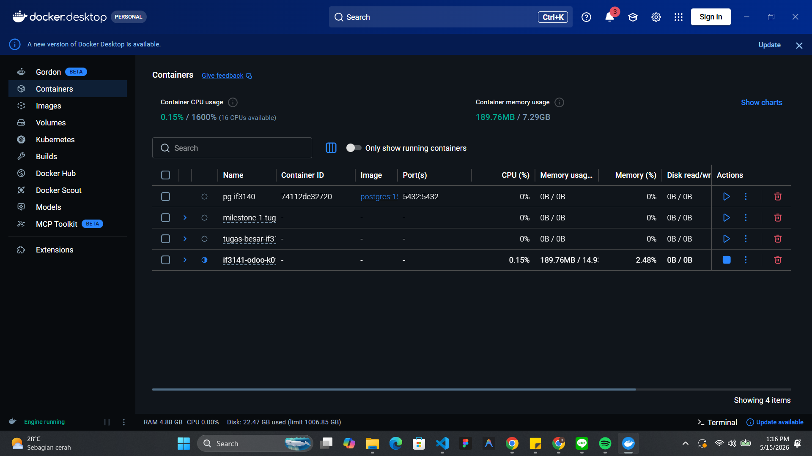
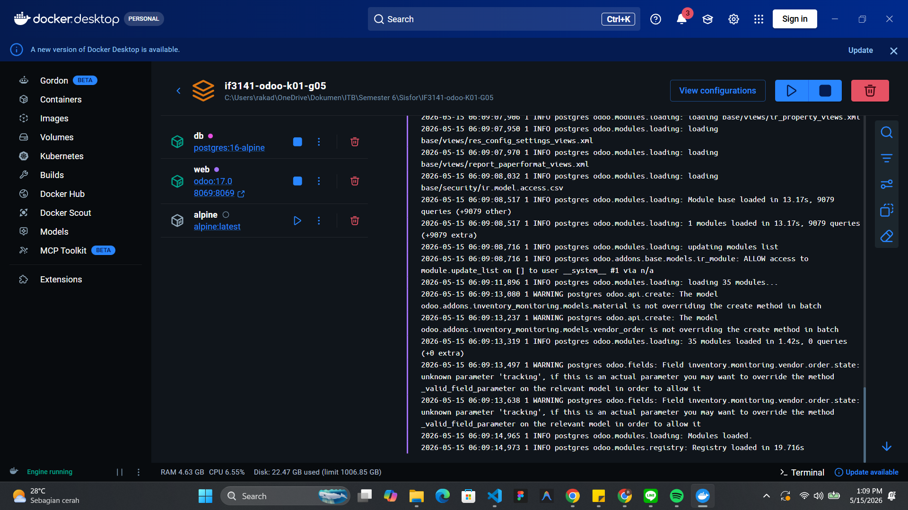
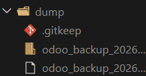
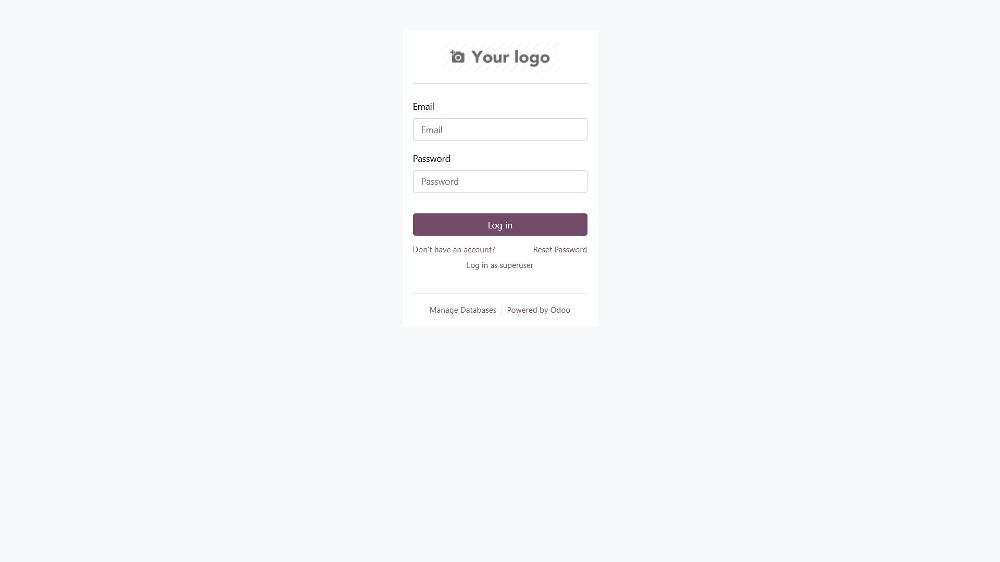
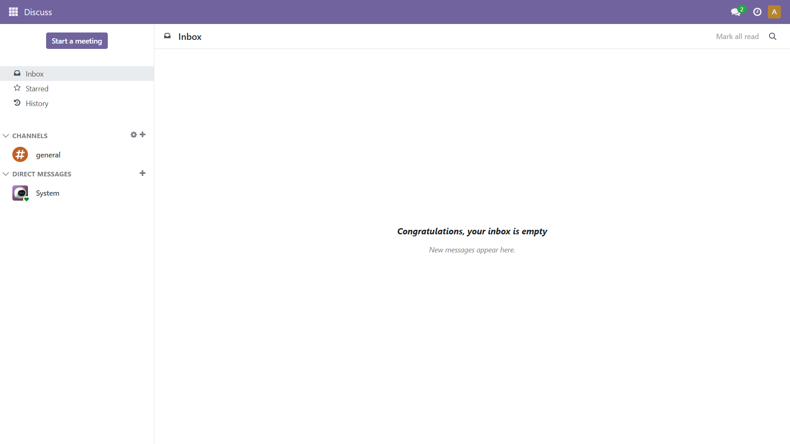
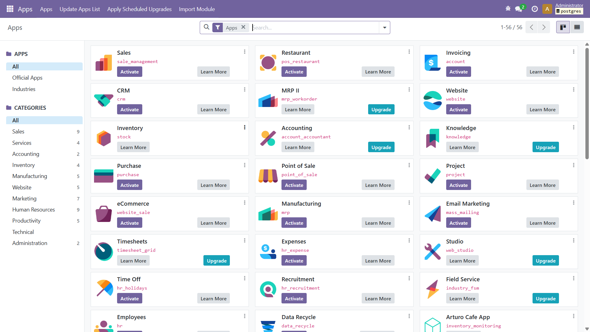
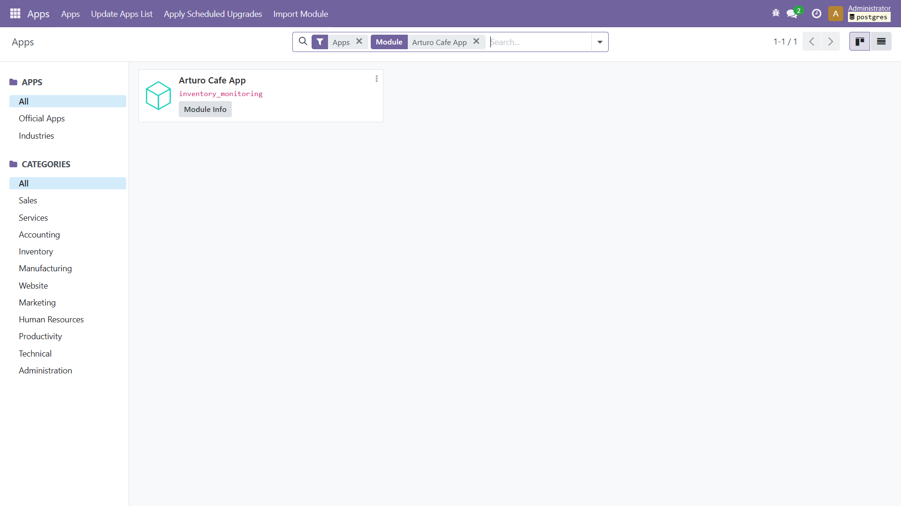
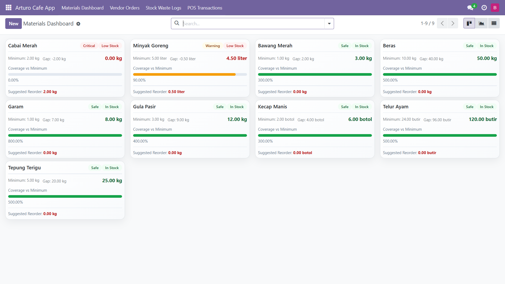

# IF3141 Sistem Informasi - README

## Identitas Kelompok

- Nama Kelompok: SI Bahagia
- Nomor Kelompok: G05
- K-01

## Anggota Kelompok

- Raka Daffa Iftikhaar - 13523018
- Joel Hotlan Haris Siahaan - 13523025
- Nadhif Radityo Nugroho - 13523045
- Mayla Yaffa Ludmilla - 13523050
- Angelina Efrina Prahastaputri - 13523060

## Nama Sistem dan Perusahaan

- Nama Sistem: Arturo Cafe App (Inventory Monitoring Module)
- Nama Perusahaan: Arturo Cafe

## Deskripsi Sistem

Arturo Cafe App adalah modul kustom Odoo untuk memantau dan mengelola inventori dapur di Arturo Cafe. Sistem ini mengatur data material, resep, transaksi POS, dan pergerakan stok secara terpusat, sehingga tim operasional dapat memastikan ketersediaan bahan baku sesuai kebutuhan harian. Akses fitur dibatasi melalui role-based access control agar setiap peran hanya melihat dan mengolah data yang relevan.

Sistem menyediakan alur kerja dari pencatatan bahan masuk, pengurangan stok akibat penggunaan atau waste, hingga pembuatan laporan inventori. Notifikasi dan laporan periodik membantu supervisor serta manajer memantau kondisi stok dan mengambil keputusan dengan cepat. Dengan demikian, proses dapur menjadi lebih terukur dan transparan.

## Cara Menjalankan Sistem

| No  | Langkah                                                   | Perintah/Kredensial                                                                | Screenshot expected result                 |
| --- | --------------------------------------------------------- | ---------------------------------------------------------------------------------- | ------------------------------------------ |
| 1   | Pastikan Docker Desktop sudah berjalan.                   | -                                                                                  |   |
| 2   | Jalankan service Odoo dan PostgreSQL.                     | `docker compose up -d`                                                             |   |
| 3   | (Opsional, jika belum ada database) Import database demo. | Windows: `scripts\import_db.cmd` macOS/Linux: `./scripts/import_db.sh`          |        |
| 4   | Buka aplikasi di browser: http://localhost:8069           | -                                                                                  |        |
| 5   | Login sebagai admin.                                      | Username: `admin` Password: `admin`                                             |        |
| 6   | Aktifkan Developer Mode dan update daftar aplikasi.       | Settings -> Developer Tools -> Activate Developer Mode Apps -> Update Apps List |   |
| 7   | Install modul "Arturo Cafe App" dan akses menu modul.     | -                                                                                  |  |
| 8   | Login menggunakan role pengguna demo untuk mencoba fitur. | -                                                                                  |          |

## Kredensial Role

Pastikan demo data aktif saat instalasi modul atau gunakan database dump agar akun demo tersedia.

| Role         | Nama          | Login                    | Password      |
| ------------ | ------------- | ------------------------ | ------------- |
| Admin        | Administrator | admin                    | admin         |
| Kitchen Team | Budi Santoso  | budi.kitchen@demo.com    | kitchen123    |
| Head Chef    | Sari Dewi     | sari.chef@demo.com       | chef123       |
| Supervisor   | Andi Wijaya   | andi.supervisor@demo.com | supervisor123 |
| Manager      | Rina Kusuma   | rina.manager@demo.com    | manager123    |

## Kesimpulan dan Saran

Sistem ini membantu Arturo Cafe mengelola stok dapur secara lebih rapi, terukur, dan aman melalui pembagian peran yang jelas. Ke depannya, sistem dapat ditingkatkan dengan fitur analitik prediksi kebutuhan bahan baku, integrasi pemasok, dan dashboard performa operasional agar pengambilan keputusan semakin cepat dan berbasis data.
